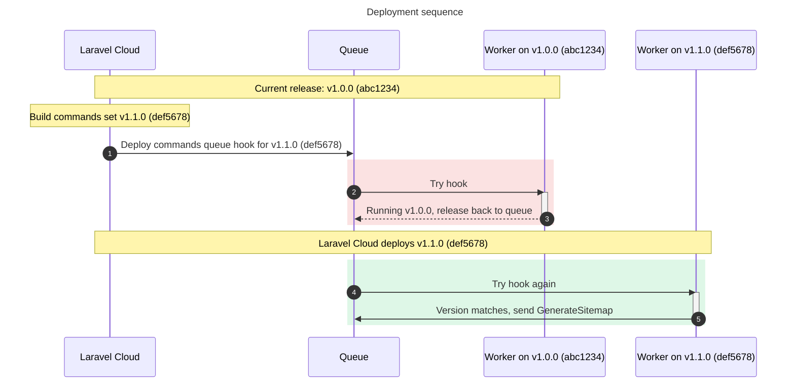
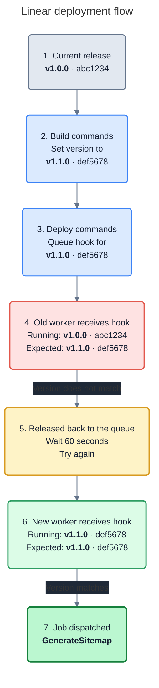

<p align="center">
    
</p>

# Laravel Post Deploy Hooks

> [!NOTE]
> This is an independent, community package. It is not an official or
> first-party Laravel package, and is not affiliated with, endorsed by, or
> sponsored by Laravel or Laravel Cloud. "Laravel" is a trademark of its
> respective owner.

Run a queued job once a worker has loaded your new release. Useful for tasks
such as generating a sitemap or refreshing cached data after deployment.

Requires PHP 8.3+ and Laravel 12+.

## Install

```bash
# Install the package...
composer require mathiasgrimm/laravel-post-deploy-hooks
```

Use a queue that supports delayed retries, such as Redis or the database queue.

## Quick start

**1. Set the version for each release.**

Set this environment variable before caching your config:

```dotenv
# The version of this release...
POST_DEPLOY_HOOKS_VERSION=release-123
```

**2. Queue your job during deployment.**

Use the same version and a job that implements Laravel's `ShouldQueue`:

```bash
# Send GenerateSitemap to the queue once a worker is running release-123...
php artisan post-deploy-hooks \
  --deploy-version=release-123 \
  --job='App\Jobs\GenerateSitemap'
```

The hook checks the worker's version. If it matches, the hook sends your job to
the queue. Otherwise, it waits 60 seconds before trying again, for up to 30 minutes.

### Laravel Cloud

Use `$LARAVEL_CLOUD_COMMIT` as the version.

**Build commands**

Add the version to the release's `.env` before caching config:

```bash
# Stop if Laravel Cloud has not provided a commit hash...
test -n "$LARAVEL_CLOUD_COMMIT" || exit 1

# Add the version to this release's .env file...
echo "POST_DEPLOY_HOOKS_VERSION=$LARAVEL_CLOUD_COMMIT" >> .env

# Cache the config with the new version, or use php artisan optimize...
php artisan config:cache
```

**Deploy commands**

After the build, queue the hook using the same version:

```bash
# Run database migrations...
php artisan migrate --force

# Queue the sitemap job for this release...
php artisan post-deploy-hooks \
  --deploy-version="$LARAVEL_CLOUD_COMMIT" \
  --job='App\Jobs\GenerateSitemap'

# Queue the job that clears the Cloudflare cache for this release...
php artisan post-deploy-hooks \
  --deploy-version="$LARAVEL_CLOUD_COMMIT" \
  --job='App\Jobs\ClearCloudflareCache'
```

### Deployment timeline





## Options

| Option | Required | Purpose |
| --- | --- | --- |
| `--deploy-version` | Yes | The version to wait for. |
| `--job` | Yes | The job class to send to the queue. |
| `--expires` | No | How many minutes the hook can wait, e.g. `60`. |
| `--with` | No | Use when your job requires constructor arguments, e.g. `'siteId=123'`. Repeat for more arguments. Values are strings. |
| `--connection` | No | Queue connection for the hook, e.g. `redis`. |
| `--queue` | No | Queue name for the hook, e.g. `deployments`. |

Argument names must match your job's constructor:

```php
namespace App\Jobs;

use Illuminate\Contracts\Queue\ShouldQueue;

class GenerateSitemap implements ShouldQueue
{
    // ...

    public function __construct(
        public string $siteId,
        public string $locale,
    ) {}

    public function handle(): void
    {
        // Generate the sitemap...
    }
}
```

Pass those arguments by name:

```bash
php artisan post-deploy-hooks \
  --deploy-version=release-123 \
  --job='App\Jobs\GenerateSitemap' \
  --with='siteId=123' \
  --with='locale=en'
```

Numbers and booleans are passed as strings too. Missing required arguments,
unknown names, and duplicate names are rejected. The job class is loaded only
after the worker reaches the requested version.

## Configuration

To change the defaults, publish the config:

```bash
# Copy the package settings into your app's config folder...
php artisan vendor:publish --tag=post-deploy-hooks-config
```

In `config/post-deploy-hooks.php`:

```php
'job' => [
    'connection' => null, // Laravel's default connection.
    'queue' => null,      // The connection's default queue.
    'expire' => 30,       // Minutes to wait.
    'backoff' => 60,      // Seconds between attempts.
    'failure_handler' => null, // Optional class to handle hook failures.
],
```

Command options override these defaults. `post-deploy-hooks.job.expire` and
`post-deploy-hooks.job.backoff` must be positive integers. Queue settings apply
to the hook; your job keeps its own settings.

## Run it programmatically

```php
use MathiasGrimm\PostDeployHooks\Jobs\PostDeployHooks;

// Wait for this release before sending the job to the queue...
PostDeployHooks::dispatch(
    version: $release,
    job: \App\Jobs\GenerateSitemap::class,
    expires: 60, // Wait up to 60 minutes.
    arguments: ['siteId' => '123', 'locale' => 'en'],
);
```

Leave out `expires` to use `post-deploy-hooks.job.expire`. Use `->onConnection()` and
`->onQueue()` to override routing. PHP arguments keep the types you supply.

## Handle failures

Set `post-deploy-hooks.job.failure_handler` to `App\Actions\ReportFailedHook::class` and create:

```php
namespace App\Actions;

use MathiasGrimm\PostDeployHooks\Contracts\HandlesFailedHooks;
use MathiasGrimm\PostDeployHooks\Jobs\PostDeployHooks;
use Throwable;

class ReportFailedHook implements HandlesFailedHooks
{
    public function handle(PostDeployHooks $hook, ?Throwable $exception): void
    {
        // Record which hook failed and why...
        logger()->error('Post-deploy hook failed', [
            'version' => $hook->version,
            'job' => $hook->jobClass,
            'exception' => $exception,
        ]);
    }
}
```

This handles hooks that expire or fail to send your job. Failures inside your
job belong in its own `failed()` method. Errors in the handler are reported but
not retried.

## Development and releases

```bash
# Install development dependencies...
composer install

# Check formatting and run the tests...
make test
```

`make test` runs Pint and Pest. To publish a new version, run
`make release VERSION=v0.1.1` from a clean `main` branch matching `origin/main`.
This runs the checks and creates a GitHub release. The GitHub CLI must be signed in.

## Credits and license

Created by [Mathias Grimm](https://github.com/mathiasgrimm). [MIT license](LICENSE.md).
